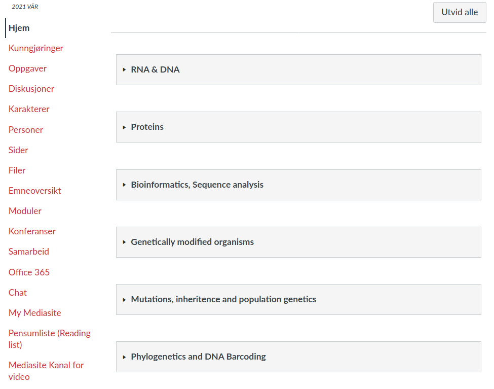
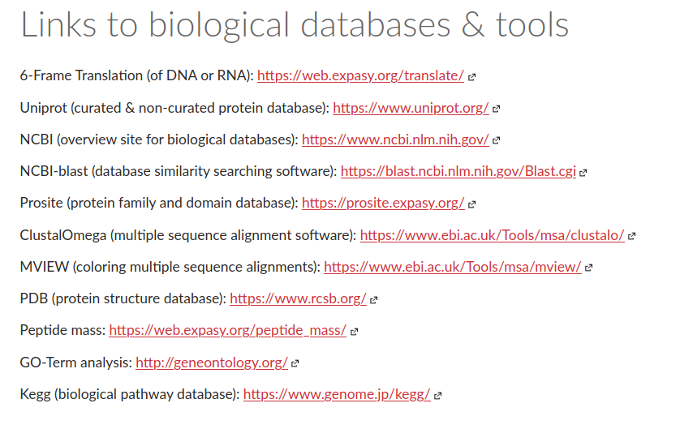

Exam Prep 2: Revisiting Material
================================

Quick Summary of Material to Review
^^^^^^^^^^^^^^^^^^^^^^^^^^^^^^^^^^^

.. warning:: *This is not a comprehensive list. It is just a good place to structure your review.*

**THEORY**
----------

This course has been organised into **modules**. 

Each module contains the relevant lecture material, and links to the recordings.

.. note:: What is not included in the modules are the homeworks and also the materials from the lab portion of the course. This does not mean they are not important! Make sure you review the theory from the lab part. I've listed homeworks under the practical skills below. 

To review the theory from the lab course go to Canvas: 

``Filer --> Lab-Molecular_cloning --> lab-slides``

**TOOLS**
----------

There are many tools that we used over and over again in the homeworks.

To get an overview of these tools (and refresh your memory), refer to the updated master list on Canvas: 

``Sider --> Links to biological databases & tools``

Some of these tools will be very familiar to you (Blast, UniProt, PDB, ClustalOmega). Others (Prosite, GO-Term, MVIEW, Kegg), we haven't used that much. You don't need to be an expert in all the tools, you just should have some idea of what they do. Usually the rest is self-explanatory on the site itself.

**PRACTICAL SKILLS**
--------------------

The exam looks exactly like one of your homeworks. So, *review your homeworks!*

Especially take a look at the answers or tutorials for each homework. 

``Filer --> Homework-Tutorials``

.. note:: There are sometimes multiple possible correct answers to a question. So, if you got full points on your homework but your answer was different than mine, that's fine. *Great minds don't actually think alike, after all*

======== ===========================================
Homework File Name
-------- -------------------------------------------
======== ===========================================
example  Sider -> Datalab 1+2: Exercises and Answers
1        homework1_answers.pdf
2        homework2_answers.pdf
3        homework3_tutorial.pdf
4        homework4_tutorial.pdf
5        homework5_tutorial.pdf
6        homework6_answers.pdf
-------- -------------------------------------------
======== ===========================================

